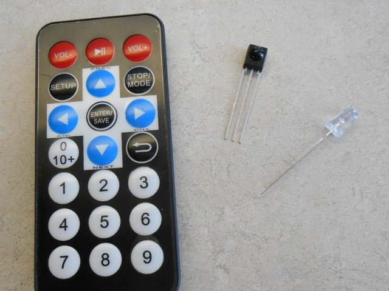

  
   

# INFRARØDE LED'er, INFRARØDE Sensorer, INFRARØD-Kommunikation & PIR Sensor
Dette repository er en guide til All-Things-Infrarød! Der beskrives hvordan man kan sende og modtage signaler ved hjælp af en Infrarød LED samt hvorledes man kan afkode signalet fra en fjernbetjening der bruger Infrarød. Derudover gennemgås der også hvordan en PIR sensor virker og hvordan man kan bruge den.

### Lidt om Infrarød

Der findes infrarødt lys overalt omkring os. Det er en del af lysspektrummet, men det menneskelige øje kan ikke se det. Vi kan dog mærke det, typisk i form af varme. Solen udsender f.eks. meget infrarødt lys. Et mere jordnært eksempel er politiets varmesøgende kameraer der har infrarøde sensorer til at se mennesker om natten da vi også udsender infrarødt lys.

### Læs mere om specifikke Infrarøde teknologier på følgende sider:

[Infrarød Kommunikation (LED, Sensor & Fjernbetjening)](/Infrarød_Kommunikation.md)

[PIR Sensor](/PIR_Sensor.md)

#### Og til sidst en joke: 
*Hvilken farve er det indvendige af en postkasse?* -> [svar](joke.md)

